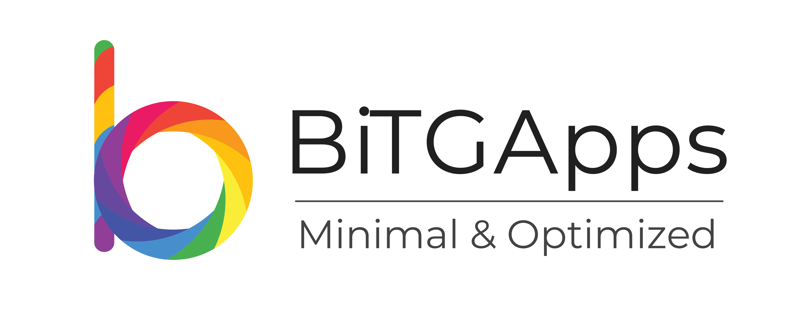

## The BiTGApps Project

  <!-- Version -->
    
  <!-- Last Updated -->
    
  <!-- License -->
    
  <!-- Status -->
    

## Introduction

A custom GApps package which contain minimal, But has all the required Google Applications to get Google Services functionality. BiTGApps support many custom features.

Here are feature highlights:

* Minimal build size
* Package size less than 90MB
* Enable Battery Optimization for all GApps
* Optimize Google Play Services for battery
* Optimize APK files with Zipalign tool
* Optimize application database with Sqlite tool
* Bootlog Patch for generating bootloop logs
* Safetynet Patch for passing CTS profile
* Whitelist Patch for disabling Privileged Permissions property
* Disable Privileged Permissions Allowlisting functionality
* Installation over Custom OS shipped with GApps
* Addon packages for supporting additional GApps packages
* Support YouTube Vanced Root version
* Ability to install YouTube Vanced Root version as Non-Root
* Disable Google SetupWizard installation
* Optimized OTA survival script implementation
* Install BiTGApps package directly from booted system
* Install BiTGApps package systemlessly as magisk module
* Ability to uninstall Additional GApps packages
* Ability to restore AOSP counter part of Additional GApps packages
* Ability to uninstall BiTGApps without doing clean installation

## Packages

## Release Tag

## Downloads

* [Click Here](https://github.com/BiTGApps/BiTGApps/wiki/Download-Portals)

## Useful Links

* [Development Forum](https://forum.xda-developers.com/t/custom-gapps-bitgapps-for-android.4012165)
* [Frequently Asked Questions](https://github.com/BiTGApps/BiTGApps/wiki/Frequently-Asked-Questions-(FAQ))
* [Common Installation Issues](https://github.com/BiTGApps/BiTGApps/wiki/Common-Installation-Issues)
* [BiTGApps Documentation](https://github.com/BiTGApps/BiTGApps/wiki)
* [microG Support](https://github.com/BiTGApps/BiTGApps/wiki#microg)

## Discussion Group

* [Telegram chat](https://t.me/bitgapps_official)

## Support Project

* [Liberapay](https://liberapay.com/TheHitMan7)
* [Patreon](https://patreon.com/TheHitMan7)
* [Paypal](https://www.paypal.me/kartikverma443)
* [buymeacoffee](https://www.buymeacoffee.com/TheHitMan7/developing-custom-android-software)

## License

The BiTGApps Project itself is licensed under the [GPLv3](https://github.com/BiTGApps/BiTGApps/blob/master/LICENSE) and anyone wanting to use it has to adhere to this license.

License terms used by the BiTGApps installer and pre-built packages

   * The BiTGApps Project does not allow creation of any project based on BiTGApps source itself like using the whole same source but with different project name.
   * BiTGApps installer scripts are provided in such a way that it can be freely used to make personal build. But does not allow its public release.
   * You are required to give us full credits for any work you may be using from us.
   * We kindly ask you to use common sense and don't profit entirely off the work of others. Renaming pre-built packages, strip author from installer and upload it anywhere as your own, be this with or without monetization.
   * The pre-built packages of BiTGApps are made available under the terms that they can be freely used for personal use only, and are not allowed to be mirrored to the public other than these sources [[1]](https://bitgapps.github.io),[[2]](https://bitgapps.com),[[3]](https://bitgapps.org).

## Author

The BiTGApps Project is authored by [TheHitMan](https://TheHitMan7.github.io)
