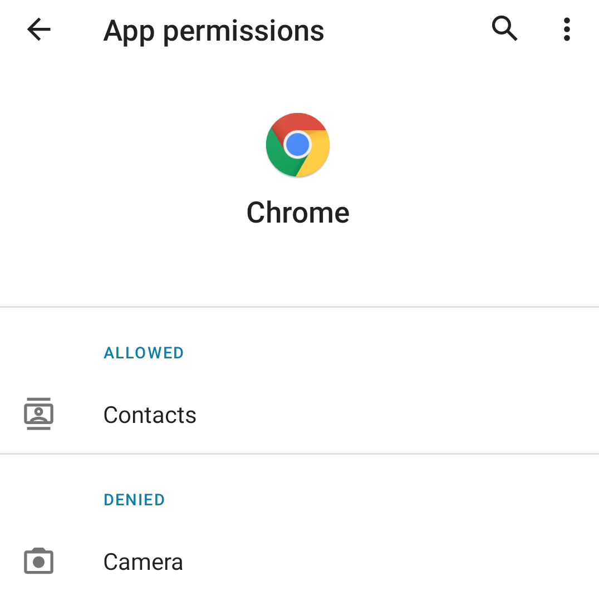

# Known Issue

Chrome should be a part of system app in Android R, but we install it as user app, which break sign-in and sync in chrome.
To fix this, allow contacts permission for chrome. Restart chrome and you can add your google account.

